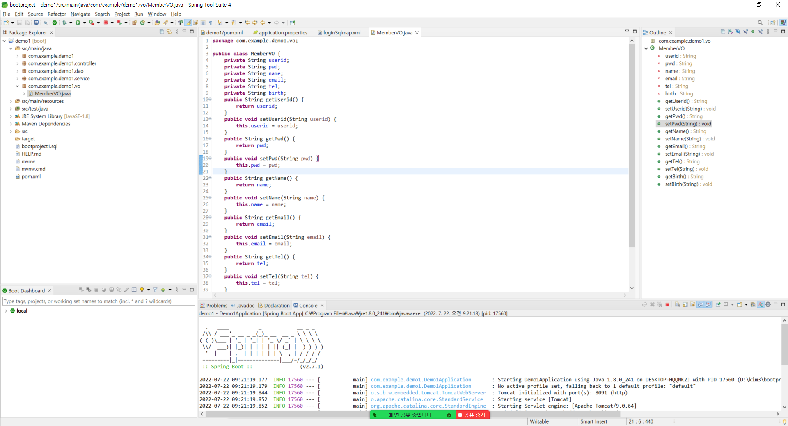

# DEMO1 프로젝트 시작

## 개발 환경
BACKEND : java 1.8, Oracle 11g XE, Spring Tool Suite 4.15.1.RELEASE
FRONTEND : html, css, javascript, jquery, bootstrap

## 새 프로젝트 만들기
[File]-[New]-[Spring Starter Project] 를 클릭하고, 아래 그림과 같이 설정 후 [Next] 버튼을 누른다.

## 의존성 설정하기
아래 그림과 같이 MyBatis Framework, Oracle Driver, Spring Web 을 찾아 추가하고, [Next] 버튼을 누른다.

## 현재 프로젝트에 적용하기
아래 그림과 같은 상태에서, [Finish]를 누른다.
그러면, spring.io에서 설정한 프로젝트를 다운로드하여 새로운 프로젝트가 만들어진다.

## 의존성 수정하기
Package Explorer에서 pom.xml 파일을 열고, 설치된 내용에서 버전을 모두 확인하고, 아래와 같이
오라클의 버전을 현재 개발환경에 설치된 오라클 11g로 변경하고, thymeleaf도 추가한다.

## 애플리케이션 설정하기
Package Explorer에서 src/main/resources 폴더 안의 application.properties를 열고, 아래 그림과 같이 개발환경에 맞게 기입하여 설정하도록 한다.

## 데이터베이스 테이블 만들기와 더미 데이터 추가하기
Oracle SQL Developer를 실행한 후 아래 그림과 같이 사용자(user1) 테이블을 만들고, 더미 데이터를 추가한다.

- - - - - - -
이후에 내용은 편의상 이미지만 com.example.demo1로 되어 있으니 여러 분들은 com.example.demo로 할 것.
- - - - - - -

## VO 클래스 만들기
Package Explorer에서 src/main/java 에 com.example.demo.vo 패키지를 추가하고 그 안에 아래 그림과 같이 MemberVO 클래스를 작성하도록 한다.

## MyBatis의 mapper 작성하기
Package Explorer에서 src/main/resources 폴더 안에 mappers 폴더를 만들고, 그 안에 login 폴더를 만든 후 아래 그림과 같이 loginSqlmap.xml을 작성하도록 한다.

## DAO 만들기
Package Explorer에서 src/main/java 에 com.example.demo.dao 패키지를 추가하고 그 안에 아래 그림과 같이 LoginDao 인터페이스를 작성하도록 한다.

## Service 만들기
Package Explorer에서 src/main/java 에 com.example.demo.service 패키지를 추가하고 그 안에 아래 그림과 같이 LoginService 인터페이스와 LoginServiceImpl 클래스를 작성하도록 한다.

## Controller 만들기
Package Explorer에서 src/main/java 에 com.example.demo.controller 패키지를 추가하고 그 안에 아래 그림과 같이 TestController 클래스를 작성하도록 한다.

## 메인 페이지 만들기
Package Explorer에서 src/main/resources/static 에 index.html을 아래 그림과 같이  작성하도록 한다.

## 애플리케이션 실행하기
Package Explorer의 해당 프로젝트에서 마우스 오른쪽 버튼을 누르고, [Run as]-[Spring boot app]을 클릭하고, 웹 브라우저를 띄운 후 다음과 같이 url을 입력하여 실행해본다.
※ 애플리케이션의 실행은 하나의 서버만 가능하므로, 만약, 수정한 내용이 있어서 다시 실행해야 한다면, 기존에 실행된 프로젝트를 정지시키고, 다시 실행해야함

